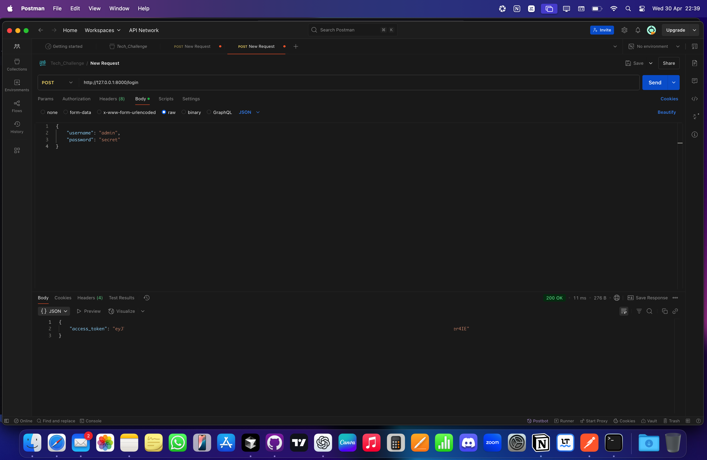
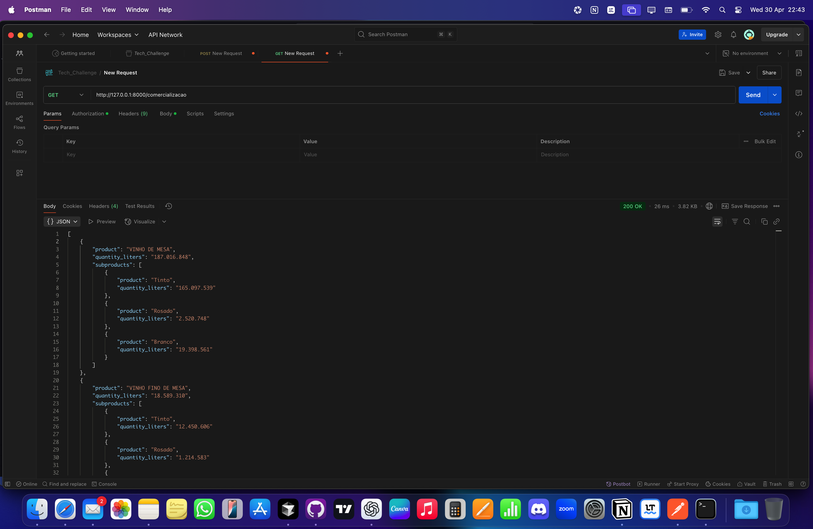
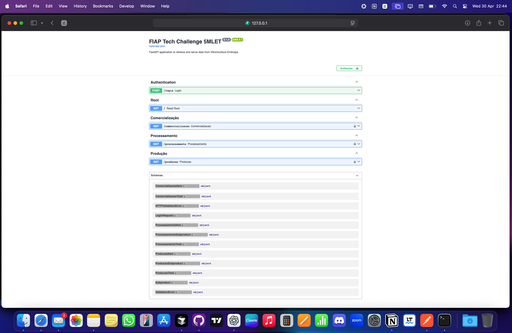

# FIAP Tech Challenge — Vitivinicultura Embrapa API

[]()


## Table of Contents

- [Features](#features)
- [Project Structure](#project-structure)
- [Authentication](#authentication)
- [Endpoints Overview](#endpoints-overview)
- [Testing Locally](#testing-locally)
- [Environment Variables](#environment-variables)
- [Poetry Usage](#poetry-usage)
- [Deployment (Render)](#deployment-render)
- [Authors](#authors)
- [License](#license)
---


> A FastAPI project to serve production, processing, commercialization, import, and export data from [Vitivinicultura Embrapa](http://vitibrasil.cnpuv.embrapa.br/).

This project was built as part of the Machine Learning Engineering postgrad challenge at [FIAP](https://github.com/fiap). It uses `Poetry`, `FastAPI`, and a custom scraping pipeline with JWT authentication.

---

## Features

- `/login` for JWT token authentication
- `/producao`, `/processamento`, `/comercializacao` endpoints with structured BaseModel responses
- Swagger and ReDoc API docs included
- Data scraped and parsed directly from Vitibrasil HTML tables
- Environment variable management with `.env` support
- Fully deployable on Render

---

## Project Structure

```
.
├── assets/               # Images used in README
├── cache/                # Cached HTML pages 
├── notebooks/            # Jupyter notebooks
├── src/
│   └── fiap_tech_challenge_5mlet/
│       ├── api/              # API routes
│       ├── auth/             # JWT handlers
│       ├── models/           # Pydantic BaseModels
│       ├── scraper/          # HTML scraping and parsing logic
│       ├── utils/            # Table parsers
│       ├── config.py         # Settings via pydantic-settings
│       └── app.py            # FastAPI app entrypoint
├── render.yaml           # Render deployment configuration
├── README.md             # Project documentation
├── .env.example          # Sample environment variables
├── pyproject.toml        # Poetry dependencies and metadata
└── poetry.lock           # Locked package versions for reproducibility
```

---

## Authentication

Make a `POST` request to `/login` with the following JSON:

```json
{
  "username": "admin",
  "password": "secret"
}
```

Returns a JWT token to access protected endpoints.



---

## Endpoints Overview

Authenticated routes include:

- `GET /comercializacao?year=2023`
- `GET /processamento?year=2023&category=viniferas`
- `GET /producao?year=2023`

**Possible HTTP Status Codes for endpoints:**
- 200 OK: Request succeeded
- 401 Unauthorized: Missing or invalid token
- 422 Unprocessable Entity: Invalid parameters
- 503 Service Unavailable: External data source unreachable

Send a `GET` request to `/comercializacao` to get data for default year`2023`:


## Docs Interface:

FastAPI automatically provides Swagger UI:

- [http://127.0.0.1:8000/docs](http://127.0.0.1:8000/docs) (if running locally) or use the deployed URL's `/docs`.


---

## Testing Locally

1. Clone this repo:
   ```bash
   git clone https://github.com/luuisotorres/fiap-tech-challenge-5mlet.git
   cd fiap-tech-challenge-5mlet
   ```

2. Install dependencies:
   ```bash
   poetry install
   ```

3. Copy `.env.example`:
   ```bash
   cp .env.example .env
   ```

4. Run app:
   ```bash
   poetry run uvicorn fiap_tech_challenge_5mlet.app:app --reload
   ```

---

## Environment Variables

Create a `.env` file using the provided `.env.example`.

| Variable               | Description                         |
|------------------------|-------------------------------------|
| JWT_SECRET_KEY         | Secret used to sign tokens          |
| JWT_ALGORITHM          | Signing algorithm (default: HS256)  |
| JWT_EXP_DELTA_SECONDS  | Token lifetime (default: 3600 sec)  |
| TEST_USERNAME          | Login username                      |
| TEST_PASSWORD          | Login password                      |

Generate a secure JWT secret with:

```bash
python -c "import secrets; print(secrets.token_urlsafe(32))"
```

---

## Poetry Usage

This project uses [Poetry](https://python-poetry.org/) for dependency management and environment isolation. Poetry simplifies handling Python packages by:

- Managing the project's virtual environment
- Installing dependencies from `pyproject.toml`
- Keeping dependency versions locked via `poetry.lock`
- Providing an easy way to run scripts inside the virtual environment

### Common Commands

- Install dependencies:

  ```bash
  poetry install
  ```

- Activate the virtual environment:

  ```bash
  poetry env activate
  ```

- Run commands inside the environment:

  ```bash
  poetry run <your-command>
  ```

Example (running the FastAPI app):

```bash
poetry run uvicorn fiap_tech_challenge_5mlet.app:app --reload
```

If you don't have Poetry installed, you can install it with:

```bash
curl -sSL https://install.python-poetry.org | python3 -
```

---

## Deployment (Render)

Use the included `render.yaml`.

```yaml
buildCommand: |
  pip install poetry
  poetry install --no-dev
startCommand: poetry run uvicorn fiap_tech_challenge_5mlet.app:app --host 0.0.0.0 --port 10000
```

Set the following in Render’s dashboard under environment:

- `JWT_SECRET_KEY`
- `JWT_ALGORITHM`
- `JWT_EXP_DELTA_SECONDS`
- `TEST_USERNAME`
- `TEST_PASSWORD`

---

## Authors

[Luis Fernando Torres](https://github.com/luuisotorres)

---

## License

MIT License